# 🚀 AI Workload Orchestrator

<div align="center">


**An intelligent, autonomous system for routing computational tasks to the optimal environment based on real-time constraints.**

[Overview](#-overview) • [Features](#-key-features) • [Architecture](#-system-architecture) • [Getting Started](#-getting-started) • [Dashboard](#-admin-dashboard) • [Tech Stack](#-technology-stack)

</div>

---

## 📖 Overview

The **AI Workload Orchestrator** is a cutting-edge simulation of a distributed computing environment. It solves the complex problem of **intelligent task offloading** by using Machine Learning to dispatch workloads to the most suitable compute node (Edge, Cloud, or GPU) in real-time.

Traditional load balancers rely on round-robin or simple static rules. This system uses a **RandomForest Classifier** trained on historical data to make sub-10ms routing decisions based on:
- **Urgency (Latency Requirements)**
- **Computational Intensity (CPU/GPU needs)**
- **Current Node Health (Load, Network Latency)**
- **Cost Sensitivity**

## ✨ Key Features

### 🧠 AI-Driven Decision Engine
- **Smart Routing**: Utilizing Scikit-learn to predict the optimal node with **96.5% accuracy**.
- **Feature Extraction**: Automatically analyzes task descriptions (e.g., "Real-time fraud detection" vs "Batch data processing") to determine priority and resource needs.

### ⚡ Real-Time Simulation Nodes
- **🟢 Edge Node**: Optimized for ultra-low latency (<50ms), ideal for sensor data and critical alerts.
- **🔵 Cloud Node**: Infinite scalability for high-throughput, latency-tolerant batch jobs.
- **🟣 GPU Node**: Specialized hardware for deep learning training and image processing tasks.

### 📊 Enterprise-Grade Monitoring
- **Admin Dashboard**: A comprehensive Streamlit-based control center for real-time system visibility.
- **Prometheus & Grafana**: Professional metrics stack allowing for deep-dive performance analysis and alerting.
- **Persistent Logging**: SQLite database integration ensures audit trails for every single task execution.

---

## 🏗 System Architecture

The system follows a microservices architecture, fully containerized with Docker.

```mermaid
flowchart TD
    %% Styling
    classDef user fill:#2d3436,stroke:#fff,stroke-width:2px,color:#fff;
    classDef ai fill:#6c5ce7,stroke:#fff,stroke-width:2px,color:#fff;
    classDef nodes fill:#00b894,stroke:#fff,stroke-width:2px,color:#fff;
    classDef storage fill:#0984e3,stroke:#fff,stroke-width:2px,color:#fff;

    User([👤 User / Client]) -->|Submit Task| API[🚀 Orchestrator API]
    
    subgraph Core Logic
        API --> Ingest[📝 Task Parsing]
        Ingest --> Extract[🔍 Feature Extraction]
        Extract --> ML{🧠 ML Decision Engine}
    end

    ML -->|Low Latency| Edge[🟢 Edge Node]
    ML -->|Heavy Compute| Cloud[🔵 Cloud Node]
    ML -->|AI/ML Task| GPU[🟣 GPU Node]

    Edge --> Result[✅ Execution Result]
    Cloud --> Result
    GPU --> Result

    Result --> DB[(💾 Task History DB)]
    Result --> Metrics[📈 Prometheus Metrics]

    class User user;
    class ML,Ingest,Extract ai;
    class Edge,Cloud,GPU nodes;
    class DB,Metrics storage;
```



### 🧠 Decision Flow
1.  **Submission**: User submits a task via the Demo UI.
2.  **Analysis**: The Orchestrator extracts semantic features (e.g., "image processing" implies GPU requirement).
3.  **Inference**: The ML model evaluates current system load vs. task needs.
4.  **Routing**: The task is dispatched to the chosen node container.
5.  **Feedback**: Execution metrics (time, cost) are logged to retrain and refine the model.

---

## 🛠 Technology Stack

| Component | Technology | Description |
|-----------|------------|-------------|
| **Backend** |  | Async REST API handling high-concurrency requests |
| **Logic** |  | Core orchestration logic and type-safe implementation |
| **AI/ML** |  | RandomForest Classifier for intelligent routing |
| **Frontend** |  | Interactive Demo UI and Admin Dashboard |
| **Database** |  | Lightweight, serverless, relational database |
| **DevOps** |  | Containerization for consistent deployment |

---

## 🚀 Getting Started

### Prerequisites
- **Docker Design**: Ensure Docker Desktop is installed and running.
- **Git**: To clone the repository.

### Installation & Running
The entire project is orchestrated via `docker-compose`. You don't need to install Python dependencies locally to run the full stack.

1.  **Clone the Repository**
    ```bash
    git clone https://github.com/yourusername/ai-workload-orchestrator.git
    cd ai-workload-orchestrator
    ```

2.  **Launch Services**
    ```bash
    docker-compose up --build
    ```
    *This command builds the images for the orchestrator, nodes, and dashboards, and starts the network.*

3.  **Access the Application**
    - **🚀 Demo UI**: [http://localhost:8501](http://localhost:8501) (Submit tasks here)
    - **📊 Admin Dashboard**: Log in via the Demo UI sidebar.
    - **📈 Grafana**: [http://localhost:3000](http://localhost:3000) (Default user/pass: `admin`/`admin`)
    - **🔌 API Docs**: [http://localhost:8000/docs](http://localhost:8000/docs)

---

## 🖥 Admin Dashboard

The project features a **Premium Admin Dashboard** to visualize the decisions made by the AI.

**Functionalities:**
- **Live Node Health**: Monitor CPU Load, Latency, and Active Tasks for Edge, Cloud, and GPU nodes.
- **Task History**: Searchable, filterable table of all executed tasks.
- **Cost Analysis**: Real-time calculation of operational costs based on node usage.
- **Analytics**: Charts showing task distribution accuracy and performance trends.

> **Access**: Click "🔐 Sign in as admin" in the Demo UI sidebar. Credentials: `admin` / `admin123`.

---

## 🔮 Future Roadmap

- [ ] **Reinforcement Learning**: Implement RL to allow the model to learn from "bad" routing decisions dynamically.
- [ ] **Kubernetes Integration**: Deploy nodes as K8s pods with Horizontal Pod Autoscaling (HPA).
- [ ] **Cloud-Native**: Migration path to AWS Lambda and Step Functions.

---

<div align="center">

**Built with ❤️ for the AI Orchestrator Hackathon**

</div>